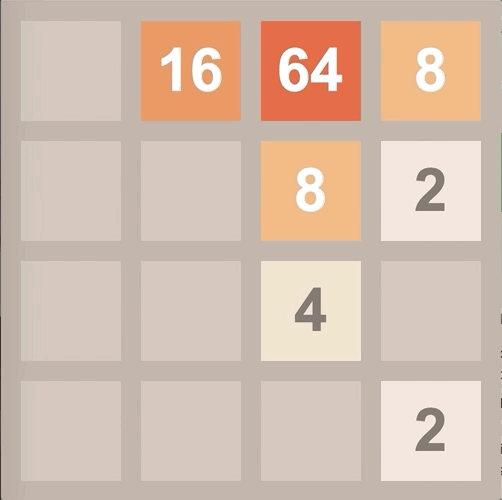

# 2048 game

This is a python implementation of the popular game 2048 using the Tkinter module.

It was pretty simple to spin up the game with Tkinter, but there were a few disadvantages:

- I had limited options with the animation frame rates. With only int-valued movements across the Tkinter canvas and a minimum 1 ms delay time, there wasn't a ton of flexibility for changing tile speeds on different rows/columns based on tile count. I ended up settling with one-tile-move per ms for my frame rate.
- It's difficult to parallelize tiles movements across rows or columns. As you can see in the gif, I loop through the rows serially as their tiles move acoss the board. The limitation is due to Tkinter functions not being pickleable, a necessary requirement for most parallelization options in python. A potential solution is to outsource this logic to [a separate non-Tkinter class](https://stackoverflow.com/a/42221437).
